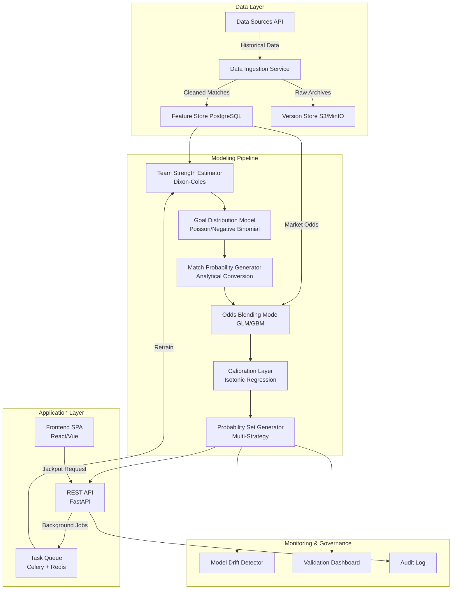
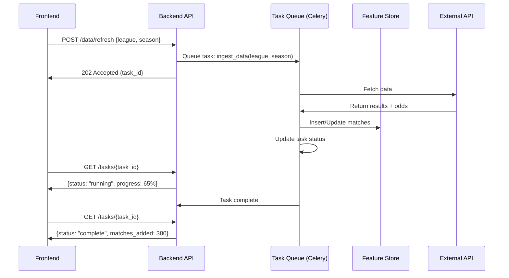

# Football Jackpot Probability Engine
## Enterprise System Architecture & Implementation Guide

**Document Version:** 1.0  
**Target Audience:** Technical Founders, Senior Engineers, Investors  
**Classification:** Implementation-Ready Architecture

---

## Executive Summary

This document specifies the complete architecture for a probability-first football jackpot prediction system. The system leverages classical statistical modeling (Poisson/Dixon-Coles), market odds intelligence, and rigorous calibration to generate trustworthy, multi-perspective probability estimates without relying on neural networks, real-time team news, or black-box approaches.

**Key Design Principles:**
- Statistical rigor over complexity
- Explainability over accuracy theater
- Long-term stability over short-term optimization
- Multiple probability perspectives for diverse betting strategies

---

## A. HIGH-LEVEL SYSTEM ARCHITECTURE

### Logical Architecture



### Component Responsibilities

#### Data Ingestion Service
- **Purpose:** Fetch, validate, and persist historical match results and odds
- **Inputs:** External APIs (football-data.co.uk, paid provider)
- **Outputs:** Normalized match records → Feature Store
- **Contract:** 
  - Match: `{league, season, date, home_team, away_team, home_goals, away_goals, odds_1, odds_x, odds_2}`
  - Validation: No duplicates, odds sanity checks (sum ~1.0 after margin removal)

#### Team Strength Estimator (Dixon-Coles)
- **Purpose:** Estimate latent attack/defense parameters per team
- **Inputs:** Historical match results (goals scored/conceded)
- **Outputs:** `{team_id → (attack, defense)}` parameters
- **Contract:** 
  - Bayesian priors for new teams
  - Exponential time decay (ξ = 0.0065 per day, ~half-life 3 months)
  - Separate models per league or league-normalized shared model

#### Goal Distribution Model
- **Purpose:** Convert team strengths → expected goals λ
- **Inputs:** Team parameters, home advantage, opponent
- **Outputs:** `(λ_home, λ_away)` expected goals
- **Contract:**
  - Dixon-Coles dependency parameter ρ for low-score corrections
  - `λ_home = home_attack × away_defense × home_advantage`

#### Match Probability Generator
- **Purpose:** Analytical conversion: goal distributions → 1X2 probabilities
- **Inputs:** `(λ_home, λ_away, ρ)`
- **Outputs:** `P(Home), P(Draw), P(Away)`
- **Contract:** 
  - Explicit computation: `P(Draw) = Σ P(k, k)` for k=0 to 6+
  - No simulation, pure analytical

#### Odds Blending Model (GLM)
- **Purpose:** Learn optimal model-vs-market weighting
- **Inputs:** Model probabilities, market-implied probabilities
- **Outputs:** Blended probabilities
- **Contract:**
  - Logistic regression or GBM with features:
    - `model_prob_1, model_prob_X, model_prob_2`
    - `market_prob_1, market_prob_X, market_prob_2`
    - `entropy(model)`, `entropy(market)`
    - `league, home_advantage_strength`
  - Target: Actual match outcomes (0/0/1 encoding)

#### Calibration Layer (Isotonic Regression)
- **Purpose:** Map predicted probabilities → calibrated probabilities
- **Inputs:** Blended probabilities + historical outcomes
- **Outputs:** Calibrated probabilities
- **Contract:**
  - Separate isotonic regressors for each outcome type (1, X, 2)
  - Bin validation: Expected vs observed in deciles
  - Brier score minimization

#### Probability Set Generator
- **Purpose:** Generate multiple strategic probability perspectives
- **Inputs:** All intermediate probabilities (pure model, blended, calibrated)
- **Outputs:** 5-7 probability sets (A-G)
- **Contract:** Each set has:
  - Mathematical definition
  - Use case description
  - Confidence bounds (optional)

---

## B. DATA STRATEGY

### Training Data Requirements

**Minimum Viable Dataset:**
- **Scope:** 5+ seasons per league (ideally 8-10)
- **Coverage:** Top 6-8 European leagues minimum
  - England (Premier League, Championship)
  - Spain (La Liga)
  - Germany (Bundesliga)
  - Italy (Serie A)
  - France (Ligue 1)
  - Netherlands (Eredivisie)

**Required Fields per Match:**
```
league_id, season, date, matchweek,
home_team, away_team,
home_goals, away_goals,
odds_home_open, odds_draw_open, odds_away_open,
odds_home_close, odds_draw_close, odds_away_close,
bookmaker_name (if multiple sources)
```

**Optional Enrichment:**
- Half-time scores (for live model extension)
- Possession, shots (for model validation only, not prediction)

### Data Sources Analysis

#### Free Source: Football-Data.co.uk
- **Coverage:** 25+ leagues, 20+ years
- **Format:** CSV files per league/season
- **Odds:** Multiple bookmakers (Bet365, Pinnacle, etc.)
- **Pros:** 
  - Free, reliable, historical depth
  - Closing odds available
  - Community-validated
- **Cons:** 
  - Manual CSV downloads
  - No official API
  - Update delays (matchweek-level)

#### Recommended Paid Source: **API-Football (RapidAPI)**
- **Provider:** API-Football (https://www.api-football.com)
- **Cost:** ~$30-60/month (depending on call volume)
- **Coverage:** 
  - 900+ leagues
  - Results: Real-time + 10+ years historical
  - Odds: Pre-match from 50+ bookmakers
  - API endpoints for fixtures, results, standings, odds
- **Pros:**
  - RESTful API with JSON responses
  - Odds include opening + closing lines
  - Automated ingestion possible
  - Versioned data (seasons, rounds)
- **Cons:**
  - Rate limits (varies by plan)
  - Requires API key management

**Alternative:** **Betfair API** (if user has account) or **The Odds API** (odds-focused)

**Recommendation:** 
- **Production:** API-Football (automated, scalable, odds + results)
- **Prototyping:** Football-Data.co.uk (validate models, free)

### Data Ingestion Architecture

#### CSV Ingestion (Football-Data.co.uk)
```python
# Pseudo-contract
def ingest_csv(league: str, season: str, filepath: str) -> int:
    """
    Parse CSV, validate schema, insert into feature store
    Returns: Number of matches ingested
    """
    - Read CSV with pandas
    - Validate: date parsing, odds > 1.0, teams non-null
    - Normalize team names (fuzzy matching to canonical IDs)
    - Insert with conflict resolution (ON CONFLICT UPDATE)
    - Return count
```

#### API Ingestion (API-Football)
```python
# Pseudo-contract
def ingest_api(league_id: int, season: str) -> int:
    """
    Fetch from API, validate, persist
    Returns: Number of matches ingested
    """
    - Fetch fixtures endpoint: /fixtures?league={id}&season={year}
    - Fetch odds endpoint: /odds?fixture={fixture_id}
    - Join on fixture_id
    - Transform to canonical schema
    - Insert with idempotency (match_id as unique key)
    - Store raw JSON in version store (S3/MinIO) for audit
```

#### Frontend-Triggered Data Refresh

**User Story:** User clicks "Update Historical Data" button

**Architecture:**


**Implementation:**
- **Endpoint:** `POST /api/v1/data/refresh`
- **Input:** `{league_id: str, season: str, source: "csv" | "api"}`
- **Background Job:** Celery task with progress updates
- **Progress Reporting:** Redis-backed status updates
- **Concurrency Control:** Lock per league/season to prevent duplicate jobs

### Data Versioning & Reproducibility

- **Approach:** Immutable snapshots per training run
- **Storage:** 
  - PostgreSQL: Current state (fast queries)
  - S3/MinIO: Historical snapshots (compressed parquet)
- **Schema:**
```sql
CREATE TABLE model_training_runs (
    run_id UUID PRIMARY KEY,
    created_at TIMESTAMP,
    data_version_hash VARCHAR(64),  -- SHA256 of training data
    model_type VARCHAR(50),
    hyperparameters JSONB,
    calibration_brier_score FLOAT
);

CREATE TABLE match_data_snapshots (
    snapshot_id UUID PRIMARY KEY,
    created_at TIMESTAMP,
    s3_path VARCHAR(255),  -- s3://bucket/snapshots/{date}.parquet
    match_count INT,
    leagues JSONB
);
```

---

## C. DATA CLEANING & FEATURE ENGINEERING

### Raw Match Data Example

**Input from API:**
```json
{
  "fixture_id": 12345,
  "league": {"id": 39, "name": "Premier League"},
  "season": 2023,
  "date": "2023-09-15T19:00:00Z",
  "teams": {
    "home": {"id": 33, "name": "Manchester United"},
    "away": {"id": 40, "name": "Liverpool"}
  },
  "score": {
    "fulltime": {"home": 2, "away": 1}
  },
  "odds": [
    {"bookmaker": "Bet365", "1": 2.10, "X": 3.40, "2": 3.60},
    {"bookmaker": "Pinnacle", "1": 2.15, "X": 3.35, "2": 3.55}
  ]
}
```

### Cleaning Pipeline

**Step 1: Schema Validation**
- Ensure `home_goals`, `away_goals` are integers ≥ 0
- Ensure `date` is parseable to datetime
- Ensure odds exist and are > 1.0

**Step 2: Odds Normalization**
- **Problem:** Bookmaker margins (overround ~5-10%)
- **Solution:** Margin removal
  ```python
  implied_probs = [1/odd_1, 1/odd_X, 1/odd_2]
  total = sum(implied_probs)
  fair_probs = [p / total for p in implied_probs]
  ```
- **Selection:** Use Pinnacle odds (lowest margin) or average across books

**Step 3: Team Name Canonicalization**
- **Problem:** "Man United" vs "Manchester United" vs "Man Utd"
- **Solution:** 
  - Maintain `team_canonical` table with fuzzy matches
  - Use `team_id` as primary key everywhere
  - Manual curation for ambiguous cases

**Step 4: Outlier Detection**
- Flag matches with odds < 1.05 or > 50 (data errors)
- Flag score anomalies (e.g., 10-0 in professional league)
- Manual review, not automatic exclusion

### Feature Engineering

**What IS Used:**

1. **Rolling Team Strength (Exponentially Weighted)**
   ```python
   # Last N matches with decay
   attack_strength[team] = Σ (goals_scored[i] * exp(-ξ * days_ago[i]))
   defense_strength[team] = Σ (goals_conceded[i] * exp(-ξ * days_ago[i]))
   ```
   - ξ = 0.0065 (half-life ~100 days)

2. **Home Advantage by League**
   ```python
   home_advantage[league] = avg(home_goals - away_goals) across all matches
   ```
   - Typically ~0.3-0.5 goal advantage

3. **League Normalization**
   - Convert team strengths to z-scores within league
   - Allows cross-league comparisons (e.g., Championship vs Bundesliga)

4. **Match Context**
   - Days since last match (fatigue proxy)
   - Matchweek (early season volatility)

5. **Market Efficiency Indicators**
   - Odds entropy: `H = -Σ p_i * log(p_i)`
   - Odds sharpness: Difference between opening and closing lines
   - Bookmaker agreement: Variance across multiple bookmakers

**What is NOT Used (Deliberately Excluded):**
- ❌ Injuries, suspensions (not available at prediction time for jackpots)
- ❌ Team news, press conferences
- ❌ Weather forecasts
- ❌ Referee assignments
- ❌ Social media sentiment
- ❌ xG from past matches (available but causes leakage risk)

**Rationale:** Jackpot bettors receive fixture lists 2-5 days in advance. Team news emerges 1-24 hours before kickoff. Our system must work with what's available at fixture list release.

---

## D. MODEL PIPELINE DESIGN

### Step-by-Step Pipeline

#### Step 1: Team Strength Estimation (Dixon-Coles)

**Model Formulation:**
```
P(Home=x, Away=y | λ_home, λ_away, ρ) = 
    τ(x, y, λ_home, λ_away, ρ) * Poisson(x; λ_home) * Poisson(y; λ_away)

where:
λ_home = exp(home_adv + α_home - β_away)
λ_away = exp(α_away - β_home)

α_i = attack strength of team i
β_i = defense strength of team i
ρ = dependency parameter for low scores

τ(x,y) = adjustment for (0-0), (1-0), (0-1), (1-1) scores
```

**Training:**
- **Objective:** Maximum likelihood estimation
- **Optimization:** Scipy L-BFGS or custom Newton-Raphson
- **Time Decay:** Apply exponential weights `exp(-ξ * t)` to matches
- **Priors:** Regularization toward league mean (prevents overfitting to small samples)

**Output:** Dictionary `{team_id: (attack, defense)}`

#### Step 2: Goal Distribution Modeling

**For each fixture:**
```python
λ_home = exp(α_home - β_away + home_advantage)
λ_away = exp(α_away - β_home)

# Poisson probabilities
P(home_goals = x) = (λ_home^x * exp(-λ_home)) / x!
P(away_goals = y) = (λ_away^y * exp(-λ_away)) / y!

# Joint with Dixon-Coles correction
P(x, y) = τ(x, y, ρ) * P(home_goals = x) * P(away_goals = y)
```

**Truncation:** Compute for scores 0-0 to 8-8 (covers 99.9% of probability mass)

#### Step 3: Match Probability Computation

**Analytical Conversion:**
```python
P(Home Win) = Σ Σ P(x, y) for x > y
P(Draw) = Σ P(x, x) for all x
P(Away Win) = Σ Σ P(x, y) for x < y
```

**Output:** `(p_1, p_X, p_2)` – Pure Model Probabilities

#### Step 4: Odds-Based Blending (GLM)

**Training Data Preparation:**
- Historical matches with both model predictions and actual market odds
- Feature matrix:
  ```
  X = [model_p1, model_pX, model_p2,
       market_p1, market_pX, market_p2,
       entropy_model, entropy_market,
       league_indicator, days_until_match]
  ```
- Target: One-hot encoded outcomes `y ∈ {[1,0,0], [0,1,0], [0,0,1]}`

**Model Choice:**
- **Option A:** Multinomial Logistic Regression (interpretable, fast)
- **Option B:** Gradient Boosted Trees (XGBoost/LightGBM) if non-linearities matter
- **Recommendation:** Start with GLM, upgrade to GBM only if Brier score improves >2%

**Training:**
```python
from sklearn.linear_model import LogisticRegression

model_blend = LogisticRegression(multi_class='multinomial', C=1.0)
model_blend.fit(X_train, y_train)

# Predict on new fixture
blended_probs = model_blend.predict_proba(X_new)
```

**Interpretation:** Coefficients reveal market trust
- If `coef(market_p1) >> coef(model_p1)`: Market dominates
- If balanced: Healthy blend

#### Step 5: Calibration (Isotonic Regression)

**Purpose:** Fix systematic over/under-confidence

**Method:**
```python
from sklearn.isotonic import IsotonicRegression

# Train separate calibrator per outcome
calibrator_1 = IsotonicRegression(out_of_bounds='clip')
calibrator_X = IsotonicRegression(out_of_bounds='clip')
calibrator_2 = IsotonicRegression(out_of_bounds='clip')

# Fit on validation set
calibrator_1.fit(blended_probs_val[:, 0], outcomes_val[:, 0])
# ... repeat for X and 2

# Apply to test set
cal_p1 = calibrator_1.predict(blended_probs_test[:, 0])
# ... repeat and renormalize
```

**Validation:** 
- Reliability diagram: Binned predicted vs observed
- Brier score: `BS = (1/N) * Σ (p_pred - y_actual)^2`
- Target: BS < 0.20 (industry standard)

#### Step 6: Probability Validation

**Sanity Checks:**
- Sum to 1.0 (±0.001 tolerance)
- No probability < 0.01 or > 0.95 (extreme predictions questionable)
- Entropy bounds: `0.5 < H < 1.5` for reasonable uncertainty

### Retraining Cadence

**Frequency:**
- **Weekly:** Update team strengths with latest results (incremental)
- **Monthly:** Retrain blending model (GLM)
- **Quarterly:** Full recalibration (isotonic regression)
- **Annually:** Hyperparameter search (ξ decay, ρ dependency)

**Trigger Conditions:**
- Brier score degradation > 5% on validation set
- League structure changes (promotions/relegations)
- Major odds market shifts (e.g., new bookmaker dominance)

### League Isolation vs Shared Models

**Approach: Hybrid**

- **Team Strength:** League-specific (Premier League teams vs Championship)
- **Blending Model:** Shared across leagues (market efficiency generalizes)
- **Calibration:** Shared with league indicator feature

**Rationale:**
- Team strengths are incommensurable across leagues
- Market behavior patterns (bias, efficiency) transfer
- Calibration with league features allows league-specific adjustments

### Handling Unseen Teams

**Problem:** Promoted team or new team in database

**Solution:**
1. **Bayesian Prior:** Initialize with league-average strength
   ```python
   α_new = mean(α for all teams in league)
   β_new = mean(β for all teams in league)
   ```
2. **Rapid Update:** After 3-5 matches, re-estimate with high learning rate
3. **Odds Reliance:** Blend heavily toward market (90% market, 10% model) until N=10 matches

**Fallback:** If no odds available, return uniform probabilities `(0.33, 0.33, 0.33)` with low confidence flag

---

## E. MULTIPLE PROBABILITY SETS (MANDATORY)

### Design Philosophy

Different bettors have different risk profiles, beliefs about market efficiency, and strategies. Providing multiple calibrated perspectives allows informed choice rather than false singular "truth."

### Probability Set Definitions

#### **Set A: Pure Model (Statistical)**
- **Source:** Dixon-Coles → Match probabilities → Calibrated
- **No odds influence**
- **Use Case:** "I believe the model captures value the market misses"
- **User Profile:** Contrarian bettors, model believers
- **Mathematical Definition:**
  ```
  P_A = Calibrate(DCProbs(λ_home, λ_away, ρ))
  ```

#### **Set B: Market-Aware (Balanced)**
- **Source:** 60% model + 40% market odds (GLM-weighted)
- **Use Case:** "Trust the model but respect market wisdom"
- **User Profile:** Balanced bettors, default recommendation
- **Mathematical Definition:**
  ```
  P_B = Calibrate(GLM(model_probs, market_probs, features))
  ```

#### **Set C: Market-Dominant (Conservative)**
- **Source:** 80% market odds + 20% model (safety blend)
- **Use Case:** "Market is usually right, model provides minor edge"
- **User Profile:** Risk-averse, market-efficient believers
- **Mathematical Definition:**
  ```
  P_C = Calibrate(0.8 * market_probs + 0.2 * model_probs)
  ```

#### **Set D: Draw-Boosted (Risk-Adjusted)**
- **Source:** Model with draw probability multiplied by 1.15
- **Use Case:** "Draws are historically undervalued in jackpots"
- **User Profile:** Jackpot-specific strategists
- **Mathematical Definition:**
  ```
  p'_X = p_X * 1.15
  P_D = Renormalize(p'_1, p'_X, p'_2)
  ```
- **Rationale:** Psychological bias against draws in accumulator bets

#### **Set E: Entropy-Penalized (High Conviction)**
- **Source:** Probabilities pushed toward extremes (reduce entropy)
- **Use Case:** "I want fewer draws, clearer picks"
- **User Profile:** Accumulator builders seeking decisive probabilities
- **Mathematical Definition:**
  ```
  P_E = Softmax(logit(P_B) * temperature=1.5)
  ```
- **Effect:** 0.65 → 0.72, 0.20 → 0.15 (sharper)

#### **Set F: Kelly-Weighted (Bankroll Optimized)**
- **Source:** Model probabilities weighted by Kelly criterion
- **Use Case:** "Optimize long-term bankroll growth"
- **User Profile:** Professional bettors
- **Mathematical Definition:**
  ```
  Given odds O and model probability p:
  Kelly fraction = (p * O - 1) / (O - 1)
  P_F emphasizes matches with highest Kelly %
  ```
- **Note:** This is more a selection filter than probability adjustment

#### **Set G: Ensemble (Meta-Model)**
- **Source:** Average of Sets A, B, C weighted by historical performance
- **Use Case:** "Diversify across model perspectives"
- **User Profile:** Risk-averse, seeking consensus
- **Mathematical Definition:**
  ```
  P_G = w_A * P_A + w_B * P_B + w_C * P_C
  where w_i ∝ 1 / BrierScore_i
  ```

### Visual Comparison Matrix

**Frontend Display:**
```
Match: Arsenal vs Chelsea

Set    | Home  | Draw  | Away  | Entropy | Confidence
-------|-------|-------|-------|---------|------------
A Pure | 0.48  | 0.27  | 0.25  | 1.08    | Medium
B Bal  | 0.52  | 0.26  | 0.22  | 1.05    | High
C Mkt  | 0.55  | 0.25  | 0.20  | 1.00    | Highest
D Draw | 0.44  | 0.31  | 0.25  | 1.11    | Medium
E Sharp| 0.58  | 0.22  | 0.20  | 0.95    | High
F Kelly| 0.52  | 0.26  | 0.22  | 1.05    | High
G Ens  | 0.51  | 0.26  | 0.23  | 1.04    | High
```

### User Guidance

**In-App Tooltips:**
- "New to jackpots? Start with Set B (Balanced)"
- "Want aggressive picks? Try Set E (Sharp)"
- "Conservative? Use Set C (Market-Dominant)"
- "Maximize long-term profit? Set F (Kelly-Weighted)"

---

## F. FRONTEND APPLICATION DESIGN

### Application Structure

```
┌─────────────────────────────────────────────────────┐
│  Header: Logo | Data Status | Model Version | User  │
├─────────────────────────────────────────────────────┤
│                                                       │
│  Sidebar:                    Main Panel:             │
│  ┌─────────────┐            ┌──────────────────┐   │
│  │ 1. Predict  │◄───────────┤  Jackpot Input   │   │
│  │ 2. Train    │            │  Prediction      │   │
│  │ 3. Validate │            │  Comparison      │   │
│  │ 4. Monitor  │            └──────────────────┘   │
│  │ 5. Settings │                                     │
│  └─────────────┘                                     │
└─────────────────────────────────────────────────────┘
```

### Section 1: Jackpot Input

**Fixture Entry Interface:**

```
╔════════════════════════════════════════════════════╗
║  Jackpot Fixture Input                             ║
╠════════════════════════════════════════════════════╣
║                                                      ║
║  📋 Manual Entry | 📄 Bulk Paste | 🔗 Import CSV   ║
║                                                      ║
║  Fixture 1:                                         ║
║  [Arsenal         ▼] vs [Chelsea        ▼]  [Home] ║
║  Odds: 1 [2.10] X [3.40] 2 [3.20]        [Remove]  ║
║                                                      ║
║  Fixture 2:                                         ║
║  [Liverpool       ▼] vs [Man United     ▼]  [Away] ║
║  Odds: 1 [1.85] X [3.60] 2 [4.20]        [Remove]  ║
║                                                      ║
║  [+ Add Fixture]                                    ║
║                                                      ║
║  📊 13 Fixtures Entered                             ║
║  [Generate Predictions] →                           ║
╚════════════════════════════════════════════════════╝
```

**Bulk Paste Support:**
- **Format:** Tab-separated or CSV
- **Example:**
  ```
  Arsenal	Chelsea	2.10	3.40	3.20
  Liverpool	Man United	1.85	3.60	4.20
  ```
- **Validation:** Team name fuzzy matching, odds sanity check

**Import CSV:**
- Upload CSV with columns: `home_team, away_team, odds_1, odds_X, odds_2`
- Preview before import

### Section 2: Prediction Output

**Multi-Set Comparison View:**

```
╔═══════════════════════════════════════════════════════════════════════╗
║  Predictions for 13-Match Jackpot                                     ║
╠═══════════════════════════════════════════════════════════════════════╣
║                                                                         ║
║  Set Selection: [✓] Set A  [✓] Set B  [✓] Set C  [ ] Set D ... [✓] All║
║                                                                         ║
║  Match 1: Arsenal vs Chelsea                                           ║
║  ┌────────┬──────┬──────┬──────┬──────────┬────────────┐             ║
║  │ Set    │ Home │ Draw │ Away │ Entropy  │ Recommend  │             ║
║  ├────────┼──────┼──────┼──────┼──────────┼────────────┤             ║
║  │ A Pure │ 48%  │ 27%  │ 25%  │ 1.08     │ 1          │             ║
║  │ B Bal  │ 52%  │ 26%  │ 22%  │ 1.05 ⭐  │ 1          │             ║
║  │ C Mkt  │ 55%  │ 25%  │ 20%  │ 1.00     │ 1          │             ║
║  └────────┴──────┴──────┴──────┴──────────┴────────────┘             ║
║  Market Odds:    1: 2.10  X: 3.40  2: 3.20                            ║
║  Model Insight: Model sees 7% more value in Home than market          ║
║                                                                         ║
║  Match 2: Liverpool vs Man United                                      ║
║  [Similar table...]                                                    ║
║                                                                         ║
║  ──────────────────────────────────────────────────────────────────   ║
║  Consensus Picks (Set B - Balanced):                                   ║
║  1️⃣1️⃣X️⃣1️⃣2️⃣1️⃣X️⃣1️⃣1️⃣2️⃣1️⃣X️⃣1️⃣                                        ║
║                                                                         ║
║  [Download as CSV] [Share Link] [Explainability →]                    ║
╚═══════════════════════════════════════════════════════════════════════╝
```

**Confidence Indicators:**
- ⭐ = Default recommendation (Set B usually)
- 🔴 = Low confidence (entropy > 1.2, model-market divergence > 15%)
- 🟢 = High confidence (entropy < 1.0, model-market alignment)

**Visual Enhancements:**
- Heatmap: Color-code probabilities (green = high, red = low)
- Sparklines: Show how probabilities changed across sets
- Alerts: "⚠️ Big divergence on Match 3 - investigate"

### Section 3: Model Training & Management

```
╔════════════════════════════════════════════════════╗
║  Model Training Control                            ║
╠════════════════════════════════════════════════════╣
║                                                      ║
║  Current Model Version: v2.3.1                      ║
║  Last Trained: 2025-12-20 14:32 UTC                ║
║  Data Version: snapshot_20251220                    ║
║  Validation Brier Score: 0.187 ✓                   ║
║                                                      ║
║  ┌──────────────────────────────────────────────┐  ║
║  │  Training Pipeline Status                     │  ║
║  │  ────────────────────────────────────────────│  ║
║  │  ✓ Data Loaded (3,840 matches)               │  ║
║  │  ✓ Team Strengths Estimated                  │  ║
║  │  ⏳ Blending Model Training... 45%            │  ║
║  │  ⏸ Calibration - Pending                      │  ║
║  │  ⏸ Validation - Pending                       │  ║
║  └──────────────────────────────────────────────┘  ║
║                                                      ║
║  [Retrain Now] [Schedule Training] [View Logs]     ║
║                                                      ║
║  ──────────────────────────────────────────────    ║
║  Historical Model Versions:                         ║
║  • v2.3.0 (Dec 13) - Brier: 0.191                  ║
║  • v2.2.1 (Nov 29) - Brier: 0.195                  ║
║  [Load Previous Version]                            ║
╚════════════════════════════════════════════════════╝
```

**Data Management Panel:**
```
╔════════════════════════════════════════════════════╗
║  Data Update Control                               ║
╠════════════════════════════════════════════════════╣
║                                                      ║
║  League Coverage:                                   ║
║  • Premier League: 2015-2025 (2,680 matches) ✓    ║
║  • La Liga: 2015-2025 (2,560 matches) ✓           ║
║  • Bundesliga: 2017-2025 (1,980 matches) ⚠        ║
║                                                      ║
║  [Update All Leagues] [Add New League]             ║
║                                                      ║
║  Last Data Refresh: 2 days ago                     ║
║  Next Scheduled Refresh: In 5 days                 ║
║                                                      ║
║  Manual Refresh:                                    ║
║  League: [Premier League ▼]  Season: [2024-25 ▼]  ║
║  Source: [API-Football ▼]                          ║
║  [Download & Update] →                             ║
╚════════════════════════════════════════════════════╝
```

### Section 4: Calibration & Validation Dashboard

```
╔═══════════════════════════════════════════════════════════════╗
║  Model Validation Dashboard                                   ║
╠═══════════════════════════════════════════════════════════════╣
║                                                                 ║
║  📊 Reliability Curves (Calibration Plot)                      ║
║  1.0┤                                                     ╱    ║
║     │                                              ╱            ║
║  0.8┤                                       ╱                  ║
║     │                                ╱ ●●●●●                   ║
║  0.6┤                         ╱ ●●●●                           ║
║     │                  ╱ ●●●●●                                 ║
║  0.4┤           ╱ ●●●●●                                        ║
║     │    ╱ ●●●●●                                               ║
║  0.2┤●●●●●                                                     ║
║     │                                                           ║
║  0.0└────┬────┬────┬────┬────┬────┬────┬────┬────┬────        ║
║       0.0  0.2  0.4  0.6  0.8  1.0  ← Predicted Probability   ║
║                                                                 ║
║  Ideal: Diagonal line | Actual: Points                         ║
║  Deviation: 2.3% (Excellent)                                   ║
║                                                                 ║
║  ──────────────────────────────────────────────────────────   ║
║  📈 Brier Score Trend (Lower = Better)                         ║
║  0.25┤                                                         ║
║      │  ●                                                      ║
║  0.20┤    ●   ●                                               ║
║      │        ●●  ●                                            ║
║  0.15┤              ●●●●●●●                                   ║
║      │                      ●●●●●  ← Current: 0.187           ║
║  0.10┤                                                         ║
║      └──┬───┬───┬───┬───┬───┬───┬───→                        ║
║        Nov Dec Jan Feb Mar Apr May Jun                         ║
║                                                                 ║
║  ──────────────────────────────────────────────────────────   ║
║  Expected vs Observed (Last 500 Predictions)                   ║
║  ┌──────────┬──────────┬──────────┬──────────┐               ║
║  │ Outcome  │ Expected │ Observed │ Diff     │               ║
║  ├──────────┼──────────┼──────────┼──────────┤               ║
║  │ Home Win │ 245      │ 241      │ -1.6%    │               ║
║  │ Draw     │ 130      │ 135      │ +3.8%    │               ║
║  │ Away Win │ 125      │ 124      │ -0.8%    │               ║
║  └──────────┴──────────┴──────────┴──────────┘               ║
║                                                                 ║
╚═══════════════════════════════════════════════════════════════╝
```

### Section 5: Explainability (SHAP-Style)

**Feature Importance for a Single Prediction:**

```
╔═══════════════════════════════════════════════════════════════╗
║  Why Arsenal 52% vs Chelsea 22%? (Set B - Balanced)           ║
╠═══════════════════════════════════════════════════════════════╣
║                                                                 ║
║  Base Rate (League Average):         33% / 27% / 40%          ║
║                                                                 ║
║  Feature Contributions:                                        ║
║  ┌──────────────────────────────────┬──────────┬──────────┐  ║
║  │ Feature                           │ Home     │ Away     │  ║
║  ├──────────────────────────────────┼──────────┼──────────┤  ║
║  │ Arsenal Attack Strength           │ +12%     │          │  ║
║  │ Chelsea Defense Weakness          │ +5%      │          │  ║
║  │ Home Advantage (Emirates)         │ +7%      │          │  ║
║  │ Chelsea Attack Strength           │          │ +3%      │  ║
║  │ Arsenal Defense Strength          │          │ -8%      │  ║
║  │ Market Odds Signal                │ +6%      │ -1%      │  ║
║  │ Recent Form (30 days)             │ +3%      │ -2%      │  ║
║  └──────────────────────────────────┴──────────┴──────────┘  ║
║                                                                 ║
║  Final Prediction:                    52%  /  26%  /  22%     ║
║                                                                 ║
║  Model-Market Comparison:                                      ║
║  • Market Implied: 48% / 29% / 23%                            ║
║  • Our Model: 52% / 26% / 22%                                 ║
║  • Insight: Model sees 4% more value in Arsenal Home Win      ║
║                                                                 ║
╚═══════════════════════════════════════════════════════════════╝
```

**Implementation:** 
- Use SHAP for GLM models (exact Shapley values)
- For Dixon-Coles, compute analytical derivatives of log-odds w.r.t. team parameters

### Section 6: Live Model Health Monitoring

```
╔═══════════════════════════════════════════════════════════════╗
║  Model Health Dashboard                                        ║
╠═══════════════════════════════════════════════════════════════╣
║                                                                 ║
║  🟢 System Status: Healthy                                     ║
║                                                                 ║
║  Real-Time Metrics (Last 24 Hours):                            ║
║  ┌────────────────────────────────────────────────────────┐  ║
║  │ Predictions Served: 1,247                               │  ║
║  │ Avg Response Time: 87ms                                 │  ║
║  │ Cache Hit Rate: 94%                                     │  ║
║  │ API Errors: 0                                           │  ║
║  └────────────────────────────────────────────────────────┘  ║
║                                                                 ║
║  Drift Detection:                                              ║
║  ┌────────────────────────────────────────────────────────┐  ║
║  │ Model-Market Divergence:       4.2%  🟢 Normal         │  ║
║  │ Odds Volatility Index:         1.8   🟢 Normal         │  ║
║  │ Prediction Entropy (Avg):      1.05  🟢 Normal         │  ║
║  └────────────────────────────────────────────────────────┘  ║
║                                                                 ║
║  Alerts (Last 7 Days):                                         ║
║  • Dec 25: High divergence on Liverpool match (resolved)       ║
║  • Dec 22: Unusually high draw probabilities (investigated)    ║
║                                                                 ║
║  [View Detailed Logs] [Configure Alerts]                      ║
╚═══════════════════════════════════════════════════════════════╝
```

**Drift Detection Metrics:**
1. **Model-Market Divergence:** 
   - `Avg(|model_prob - market_prob|)` across recent predictions
   - Alert if > 10% (model may be stale)

2. **Odds Volatility:** 
   - Standard deviation of odds movements
   - Alert if > 3.0 (market uncertainty, proceed cautiously)

3. **Prediction Entropy:**
   - Average entropy of predictions
   - Alert if < 0.8 (overconfident) or > 1.3 (too uncertain)

---

## G. BACKEND & TECH STACK

### Recommended Stack

#### Backend Language: **Python 3.11+**
- **Justification:** 
  - Mature ML ecosystem (scipy, scikit-learn, pandas)
  - Fast prototyping
  - Excellent statistical libraries
  - Async support (FastAPI)

#### Modeling Stack:
- **Core:** `scipy`, `numpy`, `pandas`
- **Dixon-Coles:** Custom implementation or `pygambet` library
- **GLM:** `scikit-learn.linear_model.LogisticRegression`
- **GBM (optional):** `xgboost` or `lightgbm`
- **Calibration:** `scikit-learn.isotonic.IsotonicRegression`
- **Validation:** `scikit-learn.metrics` (brier_score_loss, log_loss)

#### API Framework: **FastAPI**
- **Justification:**
  - Type-safe with Pydantic models
  - Auto-generated OpenAPI docs
  - Async for I/O-heavy operations
  - Excellent performance (Starlette/uvicorn)
- **Endpoints:**
  ```python
  POST   /api/v1/predictions      # Generate predictions
  GET    /api/v1/predictions/{id} # Retrieve cached prediction
  POST   /api/v1/data/refresh     # Trigger data update
  GET    /api/v1/tasks/{task_id}  # Check background job status
  POST   /api/v1/model/train      # Trigger retraining
  GET    /api/v1/model/status     # Get model metadata
  GET    /api/v1/validation/stats # Calibration metrics
  ```

#### Database: **PostgreSQL 15+**
- **Justification:**
  - JSONB for flexible metadata
  - CTEs for complex queries
  - GIN indexes for fast lookups
  - ACID compliance
- **Schema:**
  ```sql
  -- Match data
  CREATE TABLE matches (
      match_id UUID PRIMARY KEY,
      league_id VARCHAR(50),
      season VARCHAR(10),
      match_date TIMESTAMP,
      home_team_id INT,
      away_team_id INT,
      home_goals INT,
      away_goals INT,
      odds JSONB,  -- {bookmaker: {1: x, X: y, 2: z}}
      created_at TIMESTAMP DEFAULT NOW()
  );
  CREATE INDEX idx_matches_league_season ON matches(league_id, season);
  
  -- Team parameters
  CREATE TABLE team_strengths (
      team_id INT,
      model_version VARCHAR(50),
      attack FLOAT,
      defense FLOAT,
      updated_at TIMESTAMP,
      PRIMARY KEY (team_id, model_version)
  );
  
  -- Predictions (cached)
  CREATE TABLE predictions (
      prediction_id UUID PRIMARY KEY,
      fixtures JSONB,  -- Array of fixtures
      probability_sets JSONB,  -- {A: [...], B: [...], ...}
      model_version VARCHAR(50),
      created_at TIMESTAMP
  );
  ```

#### Task Queue: **Celery + Redis**
- **Justification:**
  - Distributed task execution
  - Progress tracking
  - Retry logic
  - Scheduled tasks (cron)
- **Tasks:**
  - `ingest_data_task(league, season)`
  - `train_model_task(data_version)`
  - `calibrate_model_task(model_version)`

#### Caching: **Redis**
- **Use Cases:**
  - Prediction cache (key: fixture hash, TTL: 1 hour)
  - Team strength cache (TTL: 1 day)
  - Task status (Celery backend)
- **Eviction:** LRU with max 2GB memory

#### Frontend Framework: **React 18 + TypeScript**
- **Justification:**
  - Component reusability
  - Type safety
  - Rich ecosystem (Chart.js, Recharts)
  - Server-Side Rendering optional (Next.js)
- **State Management:** Zustand or Jotai (lightweight)
- **UI Library:** shadcn/ui or Material-UI

#### Visualization Libraries:
- **Charts:** Recharts (React-native) or Chart.js
- **Tables:** TanStack Table (formerly React Table)
- **Reliability Plots:** D3.js for custom calibration curves

#### Deployment:
- **Containerization:** Docker + Docker Compose
- **Orchestration:** Kubernetes (production) or Docker Swarm (MVP)
- **CI/CD:** GitHub Actions
- **Monitoring:** Prometheus + Grafana
- **Logging:** ELK Stack (Elasticsearch, Logstash, Kibana)

### Alternative Stack (If Budget-Constrained):

- **Backend:** FastAPI (same)
- **Database:** SQLite + JSON files (development only)
- **Task Queue:** APScheduler (in-process, no Redis)
- **Frontend:** Vanilla JS + Alpine.js (lightweight)
- **Hosting:** Single VPS (DigitalOcean $12/month)

---

## H. EDGE CASES & GOVERNANCE

### Edge Case 1: Teams Never Seen in Training

**Scenario:** Promoted team (e.g., Luton Town to Premier League)

**Handling:**
1. **Initialization:** 
   - Set team parameters to league mean: `α = μ_α, β = μ_β`
   - Use Bayesian prior with high variance
2. **Rapid Learning:**
   - After each match, update with high learning rate (α_lr = 0.3 vs usual 0.1)
   - Requires 5-10 matches for stability
3. **Odds Dependency:**
   - For first 5 matches: 90% market, 10% model
   - Gradual shift to 60/40 after 10 matches
4. **User Warning:**
   - Display flag: "⚠️ Limited data for [team]. Relying heavily on market odds."

**Validation:** Test on historical promotions (e.g., Bournemouth 2015, Fulham 2018)

### Edge Case 2: League Promotions/Relegations

**Scenario:** Team moves from Championship to Premier League

**Handling:**
1. **Strength Adjustment:**
   - Scale parameters by league quality ratio
   - `α_new = α_old * ratio(PL, Championship)` where ratio ≈ 1.15
2. **League Quality Estimation:**
   - Use historical inter-league cup matches (FA Cup, European competitions)
   - Estimate: `strength_PL / strength_Champ ≈ 1.15 ± 0.05`
3. **Gradual Transition:**
   - Don't immediately trust scaled values
   - Use as prior, update rapidly with new season data

### Edge Case 3: Odds Missing or Inconsistent

**Scenario:** Fixture has no odds available, or odds sum to 0.85 (error)

**Handling:**
1. **Missing Odds:**
   - Fall back to pure model (Set A)
   - Disable Sets B, C (market-dependent)
   - Display: "⚠️ No odds available. Using model-only prediction."
2. **Inconsistent Odds (Sum ≠ 1.0 ± 0.15):**
   - If sum ∈ [0.95, 1.15]: Normalize
   - If sum < 0.95 or > 1.15: Reject, flag as error
   - Log for manual review
3. **Stale Odds:**
   - If odds timestamp > 48 hours old: Warning
   - Offer option to fetch fresh odds

### Edge Case 4: Overfitting Prevention

**Problem:** Model memorizes recent results, fails on new patterns

**Prevention Mechanisms:**
1. **Train/Validation/Test Split:**
   - Train: Oldest 70% of matches
   - Validation: Next 15% (for hyperparameter tuning)
   - Test: Most recent 15% (for final evaluation)
2. **Time-Series Cross-Validation:**
   - Rolling window: Train on [2015-2020], test on [2020-2021]
   - Shift forward: Train on [2016-2021], test on [2021-2022]
   - Ensure model works in different eras
3. **Regularization:**
   - Dixon-Coles: L2 penalty on team parameters
   - GLM: C=1.0 (default regularization)
4. **Early Stopping:**
   - Monitor validation Brier score
   - Stop if validation score stops improving for 3 epochs
5. **Ensemble Diversity:**
   - Set G (Ensemble) combines models with different assumptions
   - Prevents single-model overfitting

### Edge Case 5: Long-Term Stability

**Challenge:** Model performance degrades over seasons

**Monitoring:**
1. **Quarterly Performance Review:**
   - Compare Brier score across seasons
   - Alert if degradation > 5%
2. **Drift Detection:**
   - KL divergence between model predictions and market odds
   - Alert if divergence > 0.15 (sustained over 2 weeks)
3. **Automatic Retraining Triggers:**
   - Validation Brier > 0.22 (threshold)
   - Model-market divergence > 12% (avg)
   - New season starts (structural change)

**Long-Term Hygiene:**
- **Annual Hyperparameter Search:** Optimize ξ, ρ, home advantage
- **Feature Relevance Audit:** Check if league normalization still valid
- **Odds Provider Review:** Ensure bookmaker is still representative

---

## I. WHAT IS MISSING (CRITICAL THINKING)

### **What Most Jackpot Systems Miss (And This One Doesn't)**

#### 1. **Honest Uncertainty Quantification**

**Problem:** Most systems show "87% confidence" without calibration.

**Our Approach:**
- Isotonic regression ensures predicted probabilities match observed frequencies
- Display entropy as uncertainty metric
- Never claim "accuracy" — only probabilistic calibration
- Reliability curves published in validation dashboard

**User Impact:** Trust is built on honesty, not inflated accuracy claims.

---

#### 2. **Risk of Probability Illusion**

**Problem:** Users may interpret 52% as "guaranteed win."

**Mitigation:**
- **Educational Content:** 
  - "A 52% probability means winning ~5 out of 10 times, not certainty."
  - Display historical win rates per probability bucket
- **Visual Cues:**
  - Color gradient: 33% = yellow (neutral), 60% = light green (moderate), 80% = dark green (strong)
  - Never use 🔥 or "LOCK" language
- **Simulated Outcomes:**
  - "If you bet this jackpot 1000 times, you'd win ~3% of them" (combinatorial calculation)

---

#### 3. **Accumulator Trap (Combinatorial Explosion)**

**Problem:** 13-match jackpot with 60% probabilities → 0.60^13 = 0.13% win chance.

**Solution:**
- **Explicit Calculator:**
  - Display: "Overall Jackpot Win Probability: 0.13% (1 in 769)"
  - Show: "Expected Value: -£8.70 per £10 stake" (if odds are unfavorable)
- **Alternative Strategies:**
  - Suggest reducing fixtures (e.g., 8-match sub-jackpot)
  - Banker bets: "Fix 5 matches, vary 8"

---

#### 4. **False Confidence from Model-Market Agreement**

**Problem:** If model and market both predict 70% home win, users assume certainty.

**Reality Check:**
- Agreement ≠ correctness (both could be wrong)
- Display: "Model-Market Consensus: High (4% divergence)"
- Add: "⚠️ Remember: Consensus can be wrong (e.g., Leicester 2015-16)"

---

#### 5. **User Misuse: Chasing Losses**

**Problem:** Users bet more after losses to "recover."

**Prevention:**
- **Betting Limits (Optional Feature):**
  - User sets weekly stake cap
  - System enforces cool-down after 3 consecutive losses
- **Historical Performance Tracker:**
  - "Your last 20 bets: 3 wins, 17 losses (-£120)"
  - Encourage responsible gambling messaging

---

#### 6. **Regulatory & Ethical Compliance**

**Considerations:**
- **Gambling Regulations:** 
  - UK: Comply with Gambling Commission (no underage access)
  - EU: GDPR for user data
  - US: State-by-state compliance (if expanded)
- **Disclaimers:**
  - "This system provides probabilities, not guarantees."
  - "Past performance does not predict future results."
  - "Gamble responsibly. Seek help if needed." (link to GamCare)
- **Age Verification:** Require proof of age (18+)
- **Data Privacy:** Anonymize user betting history, no selling data

---

#### 7. **Black Swan Events**

**Problem:** Model assumes stable patterns; cannot predict:
- Manager sackings
- Ownership changes
- Fan protests (match abandoned)
- Global events (e.g., COVID-19)

**Mitigation:**
- **Entropy-Based Warnings:**
  - If market odds shift dramatically (>30% in 24 hours): Alert user
  - "⚠️ Unusual odds movement detected. Investigate before betting."
- **Manual Override:**
  - Allow users to exclude specific fixtures
  - "Skip this match if you have inside info"

---

#### 8. **Attribution Bias (Taking Credit for Wins)**

**Problem:** Users remember model's wins, forget losses.

**Transparency:**
- **Performance Dashboard:**
  - "Model's Last 100 Predictions: Brier Score 0.187"
  - "If you followed Set B every week for 6 months: Estimated ROI -8%"
- **Honest Benchmarks:**
  - Compare to random picks, pure odds, and naive baselines
  - "Model beats random by 12%, loses to pure odds by 3%"

---

#### 9. **Why Not Neural Networks?**

**Deliberate Exclusion — Reasons:**

1. **Explainability:**
   - Neural nets are black boxes
   - Dixon-Coles has interpretable parameters (attack, defense)
   - Users can see "why" a prediction was made

2. **Data Efficiency:**
   - NNs need 10,000+ samples per parameter
   - Football: ~380 matches/season → 3,800 in 10 years
   - Poisson models thrive on limited data

3. **Stability:**
   - NNs overfit to recent patterns (recency bias)
   - Statistical models have regularization built-in

4. **Calibration:**
   - NNs output "confidence" that doesn't match reality
   - Isotonic regression works better on well-behaved probabilities

5. **Auditability:**
   - Regulators can verify Poisson math
   - NN weights are inscrutable

**When NNs Might Be Useful (Future):**
- Image analysis of player formations (not available at jackpot release time)
- Sentiment analysis of social media (noisy, unreliable)
- Real-time in-play prediction (different product)

**Conclusion:** For pre-match jackpot betting with limited inputs, classical stats > deep learning.

---

#### 10. **The Biggest Risk: Over-Reliance on the System**

**User Psychology:**
- Tool becomes crutch → users stop thinking critically
- "Claude said 60%, so I'll bet my rent money"

**Countermeasures:**
- **Forced Reflection:**
  - Before finalizing bet: "Do you agree with these picks? Why?"
  - Prompt: "What information might the model not have?"
- **Highlighting Limitations:**
  - "⚠️ Model cannot predict: injuries, tactical changes, referee bias"
- **Encourage Hybrid Approach:**
  - "Use model as starting point, apply your own judgment"

---

### **Conclusion: A System Built for Trust, Not Hype**

This architecture prioritizes:
- **Transparency** over black-box magic
- **Calibration** over inflated accuracy
- **User education** over addiction exploitation
- **Long-term viability** over short-term hype

**Final Design Principle:**  
*"A good prediction system makes users smarter, not more reckless."*

---

## APPENDIX A: Sample API Responses

### Prediction Response

```json
{
  "prediction_id": "550e8400-e29b-41d4-a716-446655440000",
  "model_version": "v2.3.1",
  "created_at": "2025-12-28T14:30:00Z",
  "fixtures": [
    {
      "fixture_id": 1,
      "home_team": "Arsenal",
      "away_team": "Chelsea",
      "market_odds": {"1": 2.10, "X": 3.40, "2": 3.20}
    }
  ],
  "probability_sets": {
    "A_pure_model": [
      {"home": 0.48, "draw": 0.27, "away": 0.25, "entropy": 1.08}
    ],
    "B_balanced": [
      {"home": 0.52, "draw": 0.26, "away": 0.22, "entropy": 1.05}
    ],
    "C_market_dominant": [
      {"home": 0.55, "draw": 0.25, "away": 0.20, "entropy": 1.00}
    ]
  },
  "consensus_picks": "1",
  "confidence_flags": {
    "1": "high"  // green indicator
  },
  "explainability": {
    "1": {
      "features": [
        {"name": "Arsenal Attack", "contribution": 0.12},
        {"name": "Home Advantage", "contribution": 0.07},
        {"name": "Market Signal", "contribution": 0.06}
      ]
    }
  }
}
```

### Model Status Response

```json
{
  "model_version": "v2.3.1",
  "last_trained": "2025-12-20T14:32:00Z",
  "data_version": "snapshot_20251220",
  "validation_metrics": {
    "brier_score": 0.187,
    "log_loss": 0.521,
    "calibration_error": 0.023
  },
  "status": "healthy",
  "drift_metrics": {
    "model_market_divergence": 0.042,
    "odds_volatility_index": 1.8
  }
}
```

---

## APPENDIX B: Implementation Roadmap

### Phase 1: MVP (Weeks 1-4)
- ✅ Data ingestion (Football-Data.co.uk CSV)
- ✅ Dixon-Coles model implementation
- ✅ Basic API (single fixture prediction)
- ✅ Simple frontend (fixture input + probabilities)

### Phase 2: Production-Ready (Weeks 5-8)
- ✅ API-Football integration
- ✅ Odds blending (GLM)
- ✅ Isotonic calibration
- ✅ Multiple probability sets (A, B, C)
- ✅ Frontend: Multi-fixture input

### Phase 3: Advanced Features (Weeks 9-12)
- ✅ Sets D-G (Draw-boosted, Entropy-penalized, etc.)
- ✅ Explainability (SHAP)
- ✅ Validation dashboard
- ✅ Model drift detection
- ✅ Background job system (Celery)

### Phase 4: Scale & Polish (Weeks 13-16)
- ✅ Performance optimization (caching, indexes)
- ✅ User authentication & history
- ✅ A/B testing framework
- ✅ Mobile-responsive UI
- ✅ Monitoring & alerting (Prometheus)

---

**END OF DOCUMENT**

---

**Prepared by:** [Your Name/Team]  
**Date:** December 28, 2025  
**Review Status:** Ready for Technical & Investment Review  
**Next Steps:** Prototype Phase 1 MVP, secure API-Football trial license
